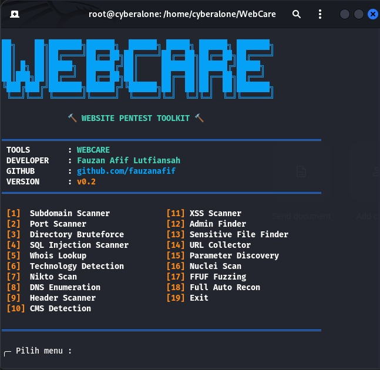

# 🔨 WebCare

<p align="center">
  
</p>

<p align="center">
Website Pentest Toolkit For Kali Linux
</p>

---

## 📌 About

WebCare is an open-source website penetration testing toolkit designed for bug hunters, cybersecurity learners, and penetration testers.

This toolkit integrates multiple popular security tools into one simple terminal interface to help perform reconnaissance, scanning, and vulnerability assessment more efficiently.

---

## ✨ Features

- Subdomain Enumeration
- Port Scanning
- Directory Bruteforce
- SQL Injection Testing
- Technology Detection
- Vulnerability Scanning
- DNS Enumeration
- Header Analysis
- CMS Detection
- XSS Testing
- Admin Panel Finder
- Sensitive File Discovery
- URL Collector
- Parameter Discovery
- Nuclei Scanner
- FFUF Fuzzing
- Full Auto Recon

---

## 🛠 Integrated Tools

- Nmap
- SQLMap
- Gobuster
- Nikto
- Subfinder
- Nuclei
- FFUF
- Gau
- Arjun
- WhatWeb
- DNSenum

---

## ⚙️ Installation

### Clone Repository

```bash
git clone https://github.com/fauzanafif/WebCare.git
```

### Move Directory

```bash
cd WebCare
```

### Permission

```bash
chmod +x *
```

### Install Dependencies

```bash
bash install.sh
```

### Run WebCare

```bash
sudo ./webcare.sh
```

---

## 📚 Requirements

- Kali Linux
- Go
- Python3
- Root Access

---

## 🔥 Example Usage

### Subdomain Enumeration

```bash
subfinder -d target.com
```

### SQL Injection Scan

```bash
sqlmap -u "https://target.com?id=1" --dbs
```

### Nuclei Scan

```bash
nuclei -u https://target.com
```

---

## ⚠️ Disclaimer

This tool is created for educational purposes and authorized security testing only.

The developer is not responsible for any misuse or illegal activities performed using this tool.

---

## 👨‍💻 Developer

Fauzan Afif Lutfiansah

GitHub:
https://github.com/fauzanafif

---

## ⭐ Support

If you like this project, don't forget to give it a star ⭐